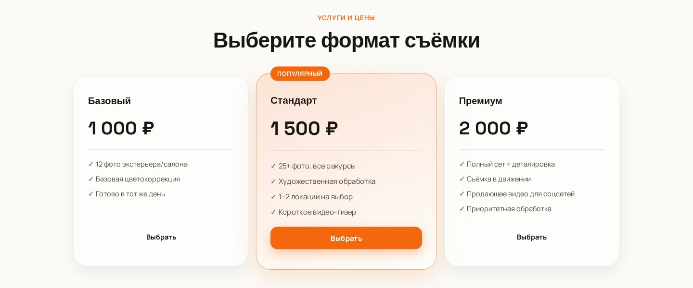

# 📸 m8rzez — автомобильный фотограф

**Сайт-портфолио для выездной съёмки автомобилей под объявления на Avito, Auto.ru и Drom.**
Работы, цены, отзывы и онлайн-запись — заявка сразу прилетает в Telegram.

 

---

## О проекте

Мой собственный сайт как фотографа: снимаю машины для продажи в Череповце. Задача сайта — за минуту показать качество работ, назвать цену и дать записаться, не уходя в мессенджеры.

## Что на сайте

- 🚗 **Портфолио** — свежие съёмки в сетке разного размера, бегущая строка с марками.
- 💸 **Три пакета** — Базовый, Стандарт, Премиум, с понятным составом и ценой.
- 👤 **Обо мне** и цифры: сколько машин снято, срок обработки.
- ⭐ **Отзывы клиентов.**
- 📝 **Онлайн-запись.** Имя, телефон, машина, пакет — заявка уходит в Telegram-бота через прокси на **Cloudflare Workers**, токен бота не светится в коде страницы.
- 🌗 **Светлая и тёмная тема**, адаптив под телефон — большинство клиентов открывают сайт именно с него.

## Скриншоты

## Стек

Статическая страница на HTML/CSS/JS, хостинг — GitHub Pages. Обработка заявок — отдельный Worker на Cloudflare, который пересылает их в Telegram.

---

Виталий · <a href="https://t.me/M8RZEZ">Telegram</a> · <a href="https://github.com/Fegke12">GitHub</a>

